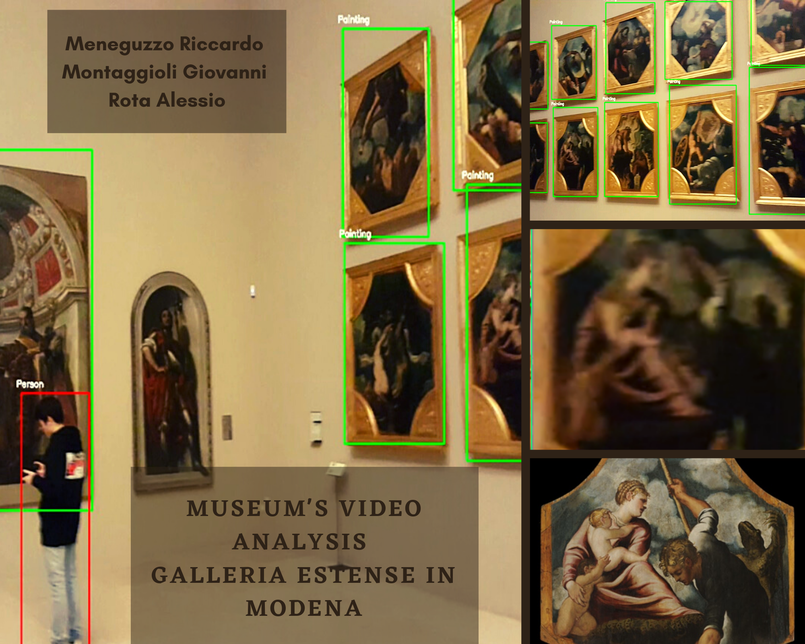

# Museum’s Video Analysis in “Galleria Estense” in Modena.

Museum’s Video Analysis in “Galleria Estense” in Modena.



## External resources

ffmpeg is required in order to let skvideo works. This is due to a well known bug in opencv, which does not correctly read videos meta data. This leads to a video orientation problem which can break our pipeline. In order to avoid that, we load the video through skvideo.

Linux:

```bash
sudo add-apt-repository ppa:mc3man/trusty-media
sudo apt-get update
sudo apt-get install ffmpeg
ffmpeg -version
```
Windows:
```bash
Put the folder named "ffmpeg" (given with the project) in C:\ 
After that, add the folder to PATH and restart the system.
```

In order to have SIFT for free, install opencv correct version.

```bash
pip install opencv-contrib-python==3.4.2.16
```
Due to limitation over upload size, we need you to download our weights (paintings.weights) from [this link](https://drive.google.com/drive/folders/1m4dWNIS_ckMN9wnVDqLjb_dA5VLV49dD?usp=sharing) and put them under "cfg" folder!


If you want to try the detection with different weights put them under "cfg" folder, than:
+ Rename them as "paintings.weights" (highly suggested), or			
+ Edit the main.py network initialization 
## Usage
In order to correctly execute the pipeline, you need to put your video/s into "media" folder. After that, just execute:

```bash
python main.py --video VIDEO
```

Useful params:
```bash
--video VIDEO : set the input video to analyze
--outH n : set the HEIGHT of the output image. Just for better visualization.
--outW n : set the WIDTH of the output image. Just for better visualization.
--skip n : Number of frame to skip every iteration. Default is 1 (view every frame)
--start_frame n: Start the process from frame n. Default is 0.
--topn n: show n results when doing paint retrieval. Default is 5.
--makevideo outputname: make a video with bounding boxes. Useful to test the detection. Remeber to specify the input video with --video
						!!! Disable all other params except --video !!!
```
Example of suggested usage:
```bash
python main.py --video VIRB0392.mp4 --outH 700 --outW 900 --skip 10 
```


## Additional informations
+ Unlucky, GPU processing for Yolo is not supported.

In this project there are 5 folders: 
+ paintings_db: contains the paintings database. ( Not on GitHub. Download that from: [here](https://drive.google.com/drive/folders/1LQX1jGNvFwzAjK7HuQWldNMOfrWtH5K2?usp=sharing) )
+ media: contains videos to be processed. (Needs to be created due to GitHub limitations over file's size)
+ cfg: contains all configuration files needed to perform paint and people detection, paint retrieval and people localization.
+ code: contains all the .py files
+ ffmpeg: contains utility for skvideo.

## Contacts
Feel free to contact us for every kind of information! 

+ Alessio Rota: 219192@studenti.unimore.it
+ Giovanni Montaggioli: 217074@studenti.unimore.it 
+ Riccardo Meneguzzo: 214927@studenti.unimore.it 
